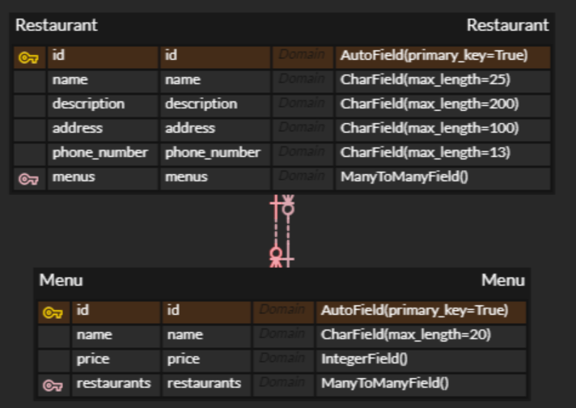

# mini_PJT


> 음식점 API를 구현하기 위한 프로젝트입니다.


## DB

> Django 기본의 `Sqlite`로 구성되었습니다.

- data가 저장된 DB가 존재합니다.

- 여러 이유로 data가 사라진 경우, 아래와 같이 data를 가져오시면 됩니다.

  ```bash
  $ python manage.py loaddata basicdata.json
  ```

  

## ERD



> 음식점(Restaurant)과 메뉴(Menu) 테이블은 M:N 관계로 설정했습니다.
>
> - 처음에는 1:N 관계로 설정하여 ForeignKey를 사용했지만, 동일한 메뉴를 사용하는 음식점이 존재할 수 있다는 점에서 M:N으로 변경했습니다다.
> - 위 테이블의 id 필드들은 Django에서 테이블 별로 자동으로 설정되는 필드로 사용했습니다.